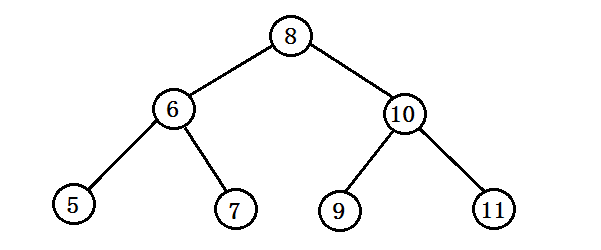

### 二叉搜索树的基本操作

<!--more-->

 

如上图所示的一棵树，左孩子以及其子树小于父亲，右孩子以及其子树大于父亲的结构。

### 二叉搜索树中的搜索

 ```java
 class Solution {
     public TreeNode searchBST(TreeNode root, int val) {
         if(root == null) {
             return null;
         }
         if(root.val > val) {
             return searchBST(root.left, val);
         } else if(root.val < val) {
             return searchBST(root.right, val);
         }
         return root;
     }
 }
 ```

---

### 二叉搜索树的插入操作

```java
class Solution {
    public TreeNode insertIntoBST(TreeNode root, int val) {
        if(root == null) {
            return new TreeNode(val);
        }
        if(val > root.val) {
            root.right = insertIntoBST(root.right, val);
        } else {
            root.left = insertIntoBST(root.left, val);
        }
        return root;
    }
}
```

---

### 二叉搜索树的验证

#### 解法一：递归

不仅仅需要保证当前结构下的左右孩子满足搜索树，

**还要保证左右孩子不破坏整体的搜索树结构**，因此记录父亲结点的父亲值。

```java
class Solution {
    public boolean isValidBST(TreeNode root) {
        return isValidBST(root, Long.MIN_VALUE, Long.MAX_VALUE);
    }

    public boolean isValidBST(TreeNode node, long lower, long upper) {
        if (node == null) {
            return true;
        }
        if (node.val <= lower || node.val >= upper) {
            return false;
        }
        boolean isLeftCorrect = isValidBST(node.left, lower, node.val);
        boolean isRightCorrect = isValidBST(node.right, node.val, upper);
        return isLeftCorrect && isRightCorrect;
    }
}
```

#### 解法二：中序遍历

**二叉搜索树的中序遍历是递增的**，根据此性质判断即可。

```java
class Solution {
    public boolean isValidBST(TreeNode root) {
        Deque<TreeNode> stack = new LinkedList<TreeNode>();
        double inorder = -Double.MAX_VALUE;

        while (!stack.isEmpty() || root != null) {
            while (root != null) {
                stack.push(root);
                root = root.left;
            }
            root = stack.pop();
              // 如果中序遍历得到的节点的值小于等于前一个 inorder，说明不是二叉搜索树
            if (root.val <= inorder) {
                return false;
            }
            inorder = root.val;
            root = root.right;
        }
        return true;
    }
}
```


