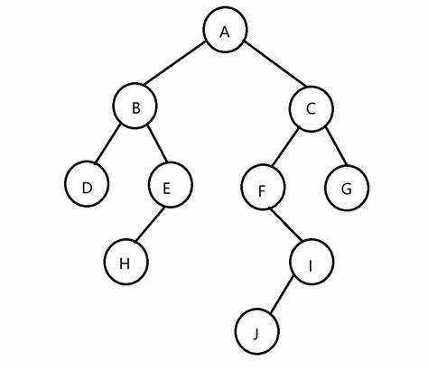

### 二叉树的三种遍历

<!--more-->

### 前言：

给定一棵二叉树的结构如下图所示，分别给出 前序、中序、后序遍历的三种结果：

 

```html
前序：A B D E H C F I J G

中序：D B H E A J I F C G

后序：D H E B J I F G C A
```

**1. 三种方式得到遍历结果**

​	递归、迭代、Morris算法

**2. 先序遍历得到根节点到某一结点的路径**

​	比如上述 A → I ：R L R

**不要使用String，因为String是定长的，因此可能会超出内存限制，使用StringBuilder代替。**

-----

### 递归遍历

代码如下：

```java
class Solution {
    StringBuilder path = new StringBuilder();
    int value;
    List<Integer> res = new LinkedList<>();

    // 先序遍历以及给出某一结点路径
    public void preorderDfs(TreeNode root,StringBuilder path) {
        if(root == null) {
            return;
        }
        // 如果查询到指定结点值 返回路径
        if(root.val == res.val) {
            this.path.append(path.toString());
        }
        // 先放入根节点
        res.add(root.val);
        preorderDfs(root.left,path.append('L'));
        path.deleteCharAt(path.length() - 1);
        preorderDfs(root.right,path.append('R'));
        path.deleteCharAt(path.length() - 1);
    }
    
    // 中序遍历
    public void inorderDfs(TreeNode root) {
        if(root == null) {
            return;
        }
        // 先放入左节点
        inorderDfs(root.left);
        res.add(root.val);
        inorderDfs(root.right);
    }
    
    // 后序遍历
    public void postorderDfs(TreeNode root) {
        if(root == null) {
            return;
        }
        postorderDfs(root.left);
        postorderDfs(root.right);
        // 最后放入根节点
        res.add(root.val);
    }

    public List<Integer> traversal(TreeNode root,int value) {
        this.value = value; 
        preorderDfs(root,new StringBuilder())
        inorderDfs(root);
        postorderDfs(root)
        return res;
    }
}
```

$$
\begin{align}
&时间复杂度:O(n)
&空间复杂度:O(n)
\end{align}
$$

---

### 迭代遍历

可以用迭代的方式实现方法一的递归函数，两种方式是等价的，

**区别在于递归的时候隐式地维护了一个栈，在迭代的时候需要显式地将这个栈模拟出来，**

其余的实现与细节都相同。

**迭代遍历相较于递归的优势：可以快速退出遍历。**

代码如下：

```java
class Solution {
    // 先序遍历
    public List<Integer> preorderTraversal(TreeNode root) {
        List<Integer> res = new ArrayList<Integer>();

        Deque<TreeNode> stack = new LinkedList<TreeNode>();
        TreeNode node = root;
        while (!stack.isEmpty() || node != null) {
            while (node != null) {
                res.add(node.val);
                stack.push(node);
                node = node.left;
            }
            node = stack.pop();
            node = node.right;
        }
        return res;
    }
    
    // 中序遍历
    public List<Integer> inorderTraversal(TreeNode root) {
        List<Integer> ans = new LinkedList<>();
        Deque<TreeNode> stack = new LinkedList<>();
        TreeNode prev = null;
        while (!stack.isEmpty() || root != null) {
            while (root != null) {
                stack.push(root);
                root = root.left;
            }
            root = stack.pop();
            ans.add(root.val);
            root = root.right;
        }
        return ans;
    }
   
    // 后序遍历
    public List<Integer> postorderTraversal(TreeNode root) {
        List<Integer> ans = new LinkedList<>();
        Deque<TreeNode> stack = new LinkedList<>();
        TreeNode prev = null;
        while (!stack.isEmpty() || root != null) {
            while (root != null) {
                stack.push(root);
                root = root.left;
            }
            root = stack.pop();
            if (root.right == null || root.right == prev) {
                ans.add(root.val);
                prev = root;
                root = null;
            } else {
                stack.push(root);
                root = root.right;
            }
        }
        return ans;
    }
}
```
$$
\begin{align}
&时间复杂度:O(n)
&空间复杂度:O(n)
\end{align}
$$

----

### Morris算法
