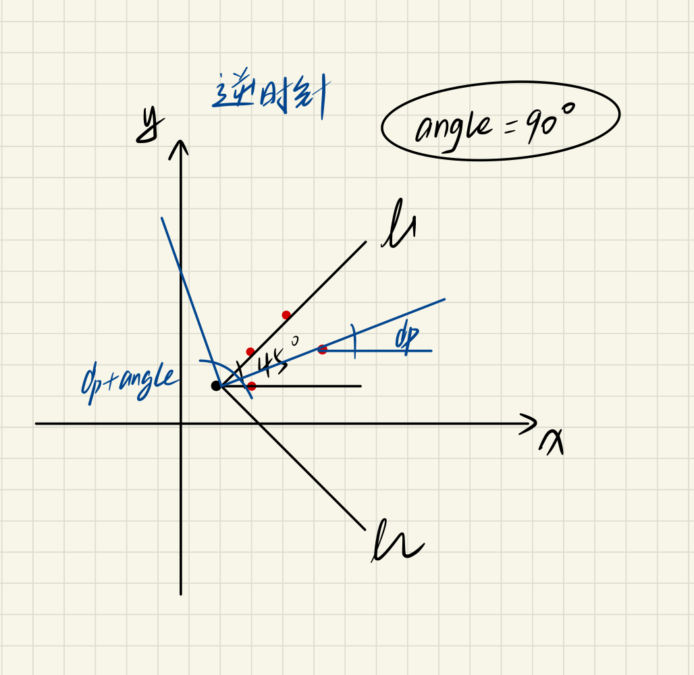
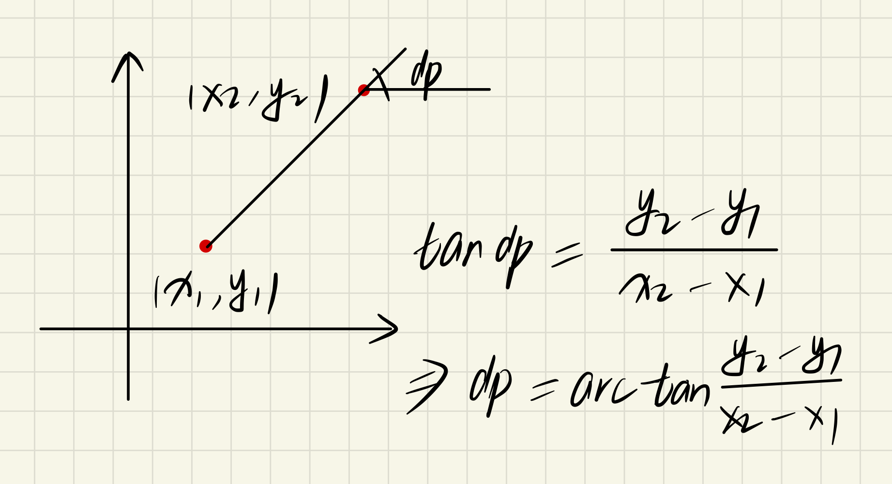
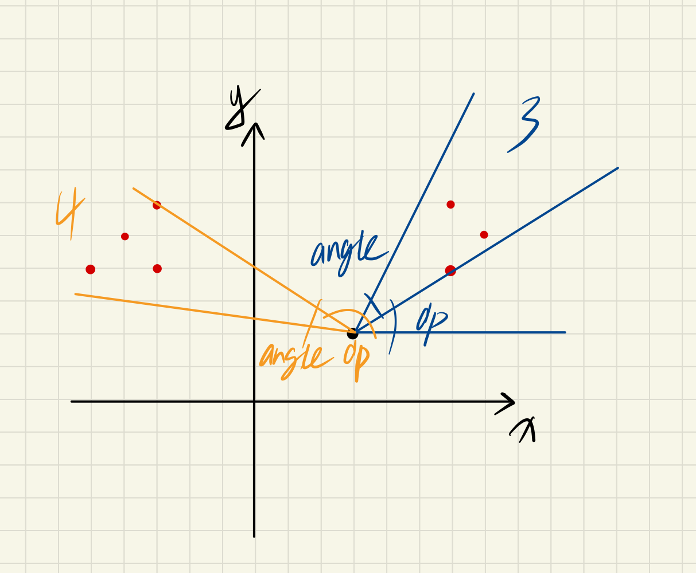
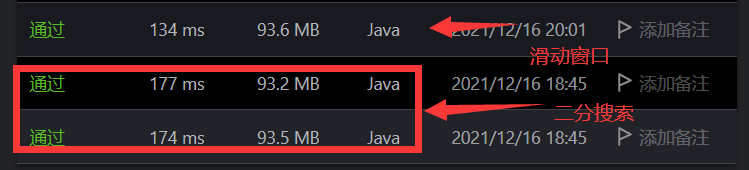

### 可见点的最大数目（ 图 | 数学）

<!--more-->

> 题目详情参考：[1610. 可见点的最大数目 - 力扣（LeetCode） (leetcode-cn.com)](https://leetcode-cn.com/problems/maximum-number-of-visible-points/)

该题目建立在数学基础上，需要对每一步都了解，层层递进。

### 解法一：二分搜索

 

```html
输入：points = [[2,1],[2,2],[3,3]], angle = 90, location = [1,1]
输出：3
```

不妨以这个示例，另外额外在图中添加一个样例点，说明一下整体思路：

1. 在本题中视角可转换为相对于 `location` 的<a href="[极角_百度百科 (baidu.com)](https://baike.baidu.com/item/极角/12726003?fr=aladdin)">极角</a>；
2. 将所有点 `point` 的坐标转化为相对于 `location` 的极角；
3. 如何通过数学计算得到极角：

 

​		在程序中，**采用 <a href="[Math (Java SE 9 & JDK 9 ) (oracle.com)](https://docs.oracle.com/javase/9/docs/api/java/lang/Math.html#atan2-double-double-)">`atan2`</a> 方法来计算，因为其值域为 [ -Π，Π ]；**

4. 不妨设当前 `point` 的极角为 `polarDegree` ，(如下简称为  d<sub>p</sub> )

    **那么找到坐标的极角处于区间 [d<sub>p</sub>, d<sub>p</sub> + angle]的最大数量即可**;

 

5. 第三步的处理很妙，即如何确定视角范围内的数量，通过极角的大小关系即可；

6. 在具体计算中，**需要特殊处理和 `location` 相同的点，**

   因为 `atan2` 的两个参数不能同时为 0；

7. **对所有点的极角排序，然后在范围内二分搜索得到数量值**，但是可能会出现下面情况：

   d<sub>p</sub> + angle > 180°，导致范围内无解，这是因为 `atan2` 所得的范围是 [-180°，180°]；

   因此将所有的极角加上 360° 再添加到原序列后面，不会影响大小排序，可以避免上述情况；

8. **注意程序中的数据是采用弧度制计算的。**

代码如下：

```java
class Solution {
    public int visiblePoints(List<List<Integer>> points, int angle, List<Integer> location) {
        int sameCnt = 0;
        List<Double> polarDegrees = new ArrayList<>();
        int locationX = location.get(0);
        int locationY = location.get(1);
        for (int i = 0; i < points.size(); ++i) {
            int x = points.get(i).get(0);
            int y = points.get(i).get(1);
            if (x == locationX && y == locationY) {
                sameCnt++;
                continue;
            }
            Double degree = Math.atan2(y - locationY, x - locationX);
            polarDegrees.add(degree);
        }
        Collections.sort(polarDegrees);

        int m = polarDegrees.size();
        for (int i = 0; i < m; ++i) {
            polarDegrees.add(polarDegrees.get(i) + 2 * Math.PI);
        }

        int maxCnt = 0;
        Double toDegree = angle * Math.PI / 180;
        for (int i = 0; i < m; ++i) {
            int iteration = binarySearch(polarDegrees, polarDegrees.get(i) + toDegree);
            maxCnt = Math.max(maxCnt, iteration - i);
        }
        return maxCnt + sameCnt;
    }

    public int binarySearch(List<Double> nums, Double target) {
        int left = 0, right = nums.size() - 1;
        int ans = nums.size();
        while (left <= right) {
            int mid = (left + right) / 2;
            if (nums.get(mid) > target) {
                right = mid - 1;
                ans = mid;
            } else {
                left = mid + 1;
            }
        }
        return ans;
    }
}
```

$$
\begin{align}
&时间复杂度:O(n×logn)
&空间复杂度:O(n)
\end{align}
$$

---

### 解法二：滑动窗口

整体思路同一，尽管整体的时间复杂度没变，但是优化了搜索过程：

**搜索过程的时间复杂度从 O(2n × log2n) 降低为 O(2n × 2n)**

 

代码如下：

```java
class Solution {
    public int visiblePoints(List<List<Integer>> points, int angle, List<Integer> location) {
        int sameCnt = 0;
        List<Double> polarDegrees = new ArrayList<>();
        int locationX = location.get(0);
        int locationY = location.get(1);
        for (int i = 0; i < points.size(); ++i) {
            int x = points.get(i).get(0);
            int y = points.get(i).get(1);
            if (x == locationX && y == locationY) {
                sameCnt++;
                continue;
            }
            Double degree = Math.atan2(y - locationY, x - locationX);
            polarDegrees.add(degree);
        }
        Collections.sort(polarDegrees);

        int m = polarDegrees.size();
        for (int i = 0; i < m; ++i) {
            polarDegrees.add(polarDegrees.get(i) + 2 * Math.PI);
        }

        int maxCnt = 0;
        int right = 0;
        double toDegree = angle * Math.PI / 180; 
        for (int i = 0; i < m; ++i) {
            Double curr = polarDegrees.get(i) + toDegree;
            while (right < polarDegrees.size() && polarDegrees.get(right) <= curr) {
                right++;
            }
            maxCnt = Math.max(maxCnt, right - i);
        }
        return maxCnt + sameCnt;
    }
}
```
$$
\begin{align}
&时间复杂度:O(n×logn)
&空间复杂度:O(n)
\end{align}
$$
