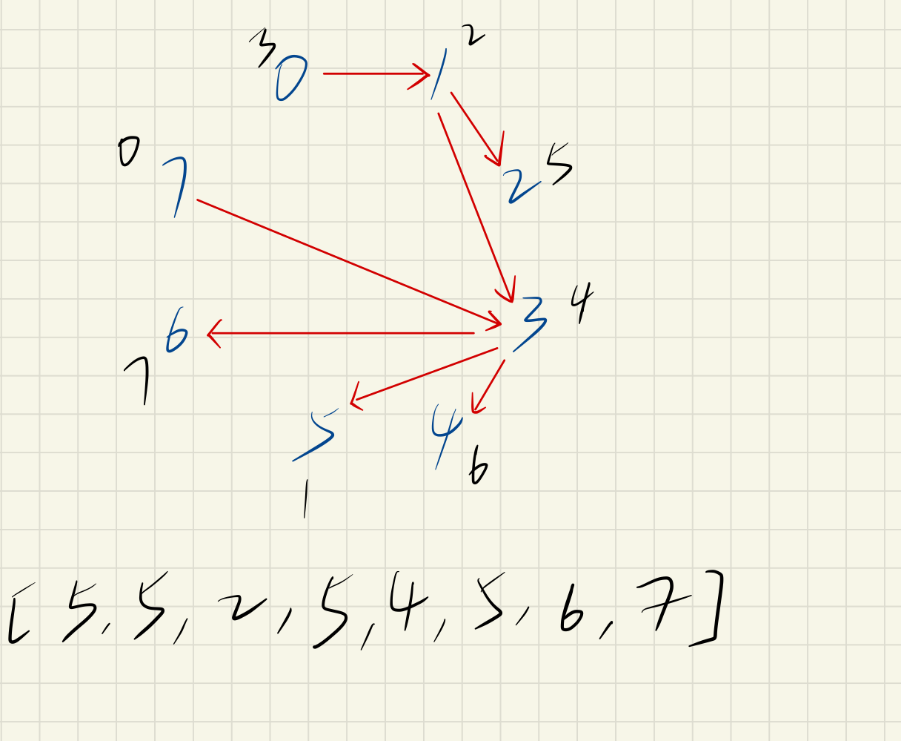
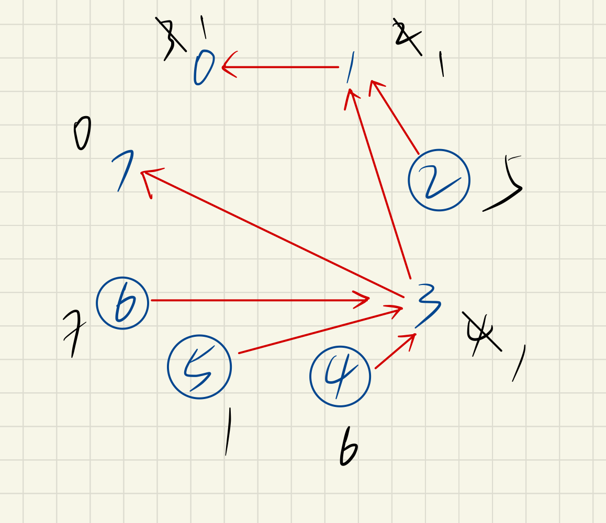

### 喧闹和富有（ DFS | 拓扑排序 ）

<!--more-->

> 题目详情参考：[851. 喧闹和富有 - 力扣（LeetCode） (leetcode-cn.com)](https://leetcode-cn.com/problems/loud-and-rich/)

心得：第一次遇见和学习有关图的问题，日复一日，必有精进。

### 解法一：深度优先搜索

思路：建立一个有向图，然后从当前点出发搜索满足题意的点。

1. 每一个人的位置看成一个点，如果 `x` 比 `y` 更有钱，那么就从 `y` 向 `x` 连一条有向边；
2. 根据题目所给数组，构建一个有向图，并且由题可知，不存在环；
3. 因此从图上任意一点（设为 `x` ）出发，沿着有向边所能访问到的点，都比 `x` 更有钱；
4. 题目需要计算拥有的钱肯定不少于 `x` 的人中，最安静的人，包括两种人：
   1. 拥有的钱等于 `x` ，比如 `x` 本身；
   2. 拥有的钱大于 `x` ，有向边所能访问的点；
5. 因此搜索所能到达的点，寻找答案；
6. 如果当前位置已经计算出最安静的人，那么就不再搜索，减少搜索。

 

代码如下：

```java
class Solution {
    public int[] loudAndRich(int[][] richer, int[] quiet) {
        int n = quiet.length;
        List<Integer>[] graph = new List[n];
        for (int i = 0; i < n; i++) {
            graph[i] = new ArrayList<>();
        }
        for (int[] value : richer) {
            graph[value[1]].add(value[0]);
        }

        int[] ans = new int[n];
        Arrays.fill(ans, -1);
        for (int i = 0; i < n; i++) {
            dfs(i, quiet, graph, ans);
        }
        return ans;
    }

    private void dfs(int x, int[] quiet, List<Integer>[] graph, int[] ans) {
        if (ans[x] != -1) {
            return;
        }
        ans[x] = x;
        for (int next : graph[x]) {
            dfs(next, quiet, graph, ans);
            if (quiet[ans[next]] < quiet[ans[x]]) {
                ans[x] = ans[next];
            }
        }
    }
}
```

$$
\begin{align}
&时间复杂度:O(n)
&空间复杂度:O(n)
\end{align}
$$

----

### 解法二：拓扑排序

思路：与思路一不同之处在于，有向图的方向为钱多指向钱少。

1. 每一个人的位置看成一个点，<strong>如果 `x` 比 `y` 更有钱，那么就从 `x` 向 `y` 连一条有向边；</strong>
2. 与此同时，**记录每一个点的入度，**以便后续处理；
3. 从图上任意一点（设为 `x` ）出发，沿着有向边所能访问到的点，都没有 `x` 有钱；
4. 因此可以在计算出 `ans[x]` 后，用 `ans[x]` 去更新 x 所能访问到的点的 `ans` 值
5. 具体开始时，依次遍历入度为 0 的点，访问更新值，并且减少已经访问点的入度；

 

代码如下：

```java
class Solution {
    public int[] loudAndRich(int[][] richer, int[] quiet) {
        int n = quiet.length;
        List<Integer>[] graph = new List[n];
        for (int i = 0; i < n; i++) {
            graph[i] = new ArrayList<>();
        }

        int[] inDeg = new int[n];
        for (int[] value : richer) {
            graph[value[0]].add(value[1]);
            inDeg[value[1]]++;
        }

        int[] ans = new int[n];
        for (int i = 0; i < n; i++) {
            ans[i] = i;
        }

        Queue<Integer> queue = new LinkedList<>();
        for (int i = 0; i < n; i++) {
            if (inDeg[i] == 0) {
                queue.offer(i);
            }
        }

        while (!queue.isEmpty()) {
            int x = queue.poll();
            for (int next : graph[x]) {
                if (quiet[ans[x]] < quiet[ans[next]]) {
                    ans[next] = ans[x];
                }
                if (--inDeg[next] == 0) {
                    queue.offer(next);
                }
            }
        }

        return ans;
    }
}
```
$$
\begin{align}
&时间复杂度:O(n)
&空间复杂度:O(n)
\end{align}
$$

