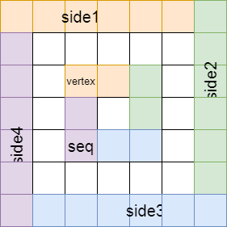

### 螺旋矩阵（数学）

<!--more-->

> > 总结螺旋矩阵的三种问题：
> >
> > 1. 由外到内，如何构造螺旋矩阵
> > 2. 由内到位，如何输出螺旋矩阵
> > 3. 如何确定螺旋矩阵的位置元素

### 螺旋矩阵Ⅰ

> > 给你一个 `m` 行 `n` 列的矩阵 `matrix` ，请按照 **顺时针螺旋顺序** ，返回矩阵中的所有元素。
> >
> > 题目详情参考：[54. 螺旋矩阵 - 力扣（LeetCode） (leetcode-cn.com)](https://leetcode-cn.com/problems/spiral-matrix/)

思路：模拟出 `顺时针螺旋顺序`

1. 创建一个  `visited` 矩阵，用来判断是否被选取过；
2. 创建方向数组 `dirs`，用来改变螺旋的方向；
3. 创建变量 `currX`、`currY`，用来记录当前位置；
4. **当模拟遍历时，如果出界或者该位置已被遍历过，那么改变方向。**

代码如下：

````java
class Solution {
    public List<Integer> spiralOrder(int[][] matrix) {
        int row = matrix.length;
        int col = matrix[0].length;
        boolean[][] visited = new boolean[row][col];
        List<Integer> ans = new LinkedList<>();

        int[][] dirs = {{0, 1}, {1, 0}, {0, -1}, {-1, 0}};
        int currX = 0;
        int currY = 0;
        int currDir = 0;

        while (ans.size() != row * col) {
            if (currX >= 0 && currY >= 0 && currX < row 
                && currY < col && !visited[currX][currY]) {
                ans.add(matrix[currX][currY]);
                visited[currX][currY] = true;
            } else {
                currX -= dirs[currDir][0];
                currY -= dirs[currDir][1];
                currDir++;
                currDir %= 4;
            }
            currX += dirs[currDir][0];
            currY += dirs[currDir][1];
        }
        return ans;
    }
}
````

$$
\begin{align}
&时间复杂度:O(m×n)
&空间复杂度:O(m×n)
\end{align}
$$

----

### 螺旋矩阵Ⅱ

> >给你一个正整数 `n` ，生成一个包含 `1` 到 `n × n` 所有元素，且元素按顺时针顺序螺旋排列的 `n x n` 正方形矩阵 `matrix` 。
> >
> >题目详情参考：[59. 螺旋矩阵 II - 力扣（LeetCode） (leetcode-cn.com)](https://leetcode-cn.com/problems/spiral-matrix-ii/)

思路：

1. 与螺旋矩阵Ⅰ的思路大体相似，不过是生成螺旋矩阵；

2. 创建变量 `num` 填充并记录螺旋矩阵元素，遍历即可。

代码如下:

```java
class Solution {
    public int[][] generateMatrix(int n) {
        int[][] ans = new int[n][n];
        boolean[][] visited = new boolean[n][n];

        int[][] dirs = {{0, 1}, {1, 0}, {0, -1}, {-1, 0}};
        int currX = 0;
        int currY = 0;
        int currDir = 0;
        int num = 1;

        while (num <= n * n) {
            if (currX >= 0 && currY >= 0 && currX < n 
                && currY < n && !visited[currX][currY]) {
                ans[currX][currY] = num++;
                visited[currX][currY] = true;
            } else {
                currX -= dirs[currDir][0];
                currY -= dirs[currDir][1];
                currDir++;
                currDir %= 4;
            }
            currX += dirs[currDir][0];
            currY += dirs[currDir][1];
        }
        return ans;
    }
}
```

$$
\begin{align}
&时间复杂度:O(m×n)
&空间复杂度:O(m×n)
\end{align}
$$

---

### 螺旋矩阵Ⅲ

> >在 R 行 C 列的矩阵上，我们从 (r0, c0) 面朝东面开始
> >
> >这里，网格的西北角位于第一行第一列，网格的东南角位于最后一行最后一列。
> >
> >现在，我们以顺时针按螺旋状行走，访问此网格中的每个位置。
> >
> >每当我们移动到网格的边界之外时，我们会继续在网格之外行走（但稍后可能会返回到网格边界）。
> >
> >最终，我们到过网格的所有 R * C 个空间。
> >
> >按照访问顺序返回表示网格位置的坐标列表。
> >
> >```html
> >输入：R = 1, C = 4, r0 = 0, c0 = 0
> >输出：[[0,0],[0,1],[0,2],[0,3]]
> >```

思路：前面两个螺旋矩阵都是由外向内旋转，而此矩阵是由内向外旋转

1. 首先扩充该矩阵为 `n × n`  的方形矩阵，其中 `n` 为选中位置距离边界的最大距离；
2. **模拟遍历可知，最后的终点是拓展矩阵的右上角位置，那么可以反方向旋转求解；**
3. 至此，已经转化为前两个问题，不过仍有需要注意的地方：
   1. 起始位置和方向发生改变
   2. 需要记录拓展矩阵中哪些是需要记录的元素
   3. 如何确定原矩阵的位置

代码如下:

```java
class Solution {
    public int[][] spiralMatrixIII(int rows, int cols, int rStart, int cStart) {
        int nums = rows * cols;
        boolean[][] matrix = getExpendedMatrix(rows, cols, rStart, cStart);
        int sideLength = getSideLength(rows, cols, rStart, cStart);
        return getSipralOrder(matrix, nums, sideLength - rStart, sideLength - cStart);
    }

    private boolean[][] getExpendedMatrix(int rows, int cols, int rStart, int cStart) {
        int sideLength = getSideLength(rows, cols, rStart, cStart);
        int matrixSize = sideLength * 2 + 1;
        boolean[][] matrix = new boolean[matrixSize][matrixSize];
        for (int i = sideLength - rStart; i < sideLength - rStart + rows; i++) {
            for (int j = sideLength - cStart; j < sideLength - cStart + cols; j++) {
                matrix[i][j] = true;
            }
        }
        return matrix;
    }

    private int getSideLength(int rows, int cols, int rStart, int cStart) {
        int maxRow = Math.max(rStart, rows - 1 - rStart);
        int maxCol = Math.max(cStart, cols - 1 - cStart);
        int sideLength = Math.max(maxRow, maxCol);
        return sideLength;
    }

    private int[][] getSipralOrder(boolean[][] matrix, int nums, int deltaX, int deltaY) {
        int size = matrix.length;
        boolean[][] visited = new boolean[size][size];
        int[][] ans = new int[nums][2];
        int index = 0;

        int[][] dirs = {{0, -1}, {1, 0}, {0, 1}, {-1, 0}};
        int currX = 0;
        int currY = size - 1;
        int currDir = 0;

        while (index != nums) {
            if (currX >= 0 && currY >= 0 && currX < size 
                && currY < size && !visited[currX][currY]) {
                if (matrix[currX][currY]) {
                    ans[nums - index - 1][0] = currX - deltaX;
                    ans[nums - index - 1][1] = currY - deltaY;
                    index++;
                }
                visited[currX][currY] = true;
            } else {
                currX -= dirs[currDir][0];
                currY -= dirs[currDir][1];
                currDir++;
                currDir %= 4;
            }
            currX += dirs[currDir][0];
            currY += dirs[currDir][1];
        }
        return ans;
    }
}
```

$$
\begin{align}
&时间复杂度:O(m×n)
&空间复杂度:O(m×n)
\end{align}
$$

---

### 螺旋矩阵Ⅳ

> > 给定一个 `n * n` 的矩阵，螺旋排列，如何确定某一位置的元素？
> >
> > 题目详情参考：[LCP 29. 乐团站位 - 力扣（LeetCode） (leetcode-cn.com)](https://leetcode-cn.com/problems/SNJvJP/)



1. 将矩阵按圈的循环进行分割，再将圈，按照上述形式分割；
2. 当前坐标为 <em>( xPos , yPos )</em>，首先获得该点所在的圈数，然后进行计算；
3. 计算当前圈数前所有的点数，一个简单的等差数列求和；
4. 分类讨论当前点所在圈的位置情况，计算总数，取余即为答案。

**注意事项：**

1. 数据过大，将所有变量声明为 `long`；
2. 结果取余时，为 `0` 时需要特殊考虑；
3. 分类讨论时，不需要加上边界限制；

代码如下：

```java
class Solution {
    public int orchestraLayout(int num, int xPos, int yPos) {
        // 得到当前所在圈数 圈数从 0 开始
        long numOfTurns = Math.min(xPos, yPos);
        numOfTurns = Math.min(num - 1 - yPos, numOfTurns);
        numOfTurns = Math.min(num - 1 - xPos, numOfTurns);

        // 计算先前所有的点数和，以及当前圈的边长
        long preSum = (4 * (long) num - 4 * numOfTurns) * numOfTurns;
        long sideLength = num - 2 * numOfTurns - 1;

        // 分类讨论得到目前点数和
        long currNum;
        if (xPos == numOfTurns) {
            currNum = preSum + yPos - numOfTurns + 1;
        } else if (yPos == num - 1 - numOfTurns) {
            currNum = preSum + sideLength + xPos - numOfTurns + 1;
        } else if (xPos == num - 1 - numOfTurns) {
            currNum = preSum + sideLength * 3 - yPos + numOfTurns + 1;
        } else {
            currNum = preSum + sideLength * 4 - xPos + numOfTurns + 1;
        }
        currNum %= 9;

        return currNum == 0 ? 9 : (int) currNum;
    }
}
```

$$
\begin{align}
&时间复杂度:O(1)
&空间复杂度:O(1)
\end{align}
$$

